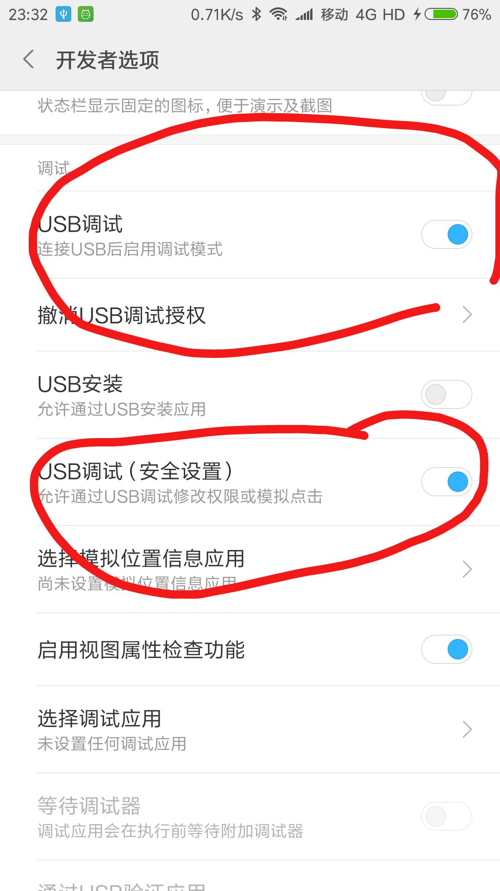

# FAQ
>这里将对一些用户常见问题作出解答

#### 1. 为什么电脑端正常执行，但是手机却不跳？

【答】有的手机会有USB调试安全选项，在未打开的情况下，禁止模拟点击，把这个打开就好了。

   
    
#### 2. 为什么棋子落点总是计算错误？

【答】三星曲面屏手机请关闭曲面侧屏，其他手机如果有类似悬浮球的控件，也请关闭，否则会影响图像识别。

#### 3. 使用系统推荐跳跃系数跳不准怎么办？

【答】推荐跳跃系数没有适配所有机型，如果跳跃系数不准，请自己慢慢调整适合自己手机的跳跃系数。